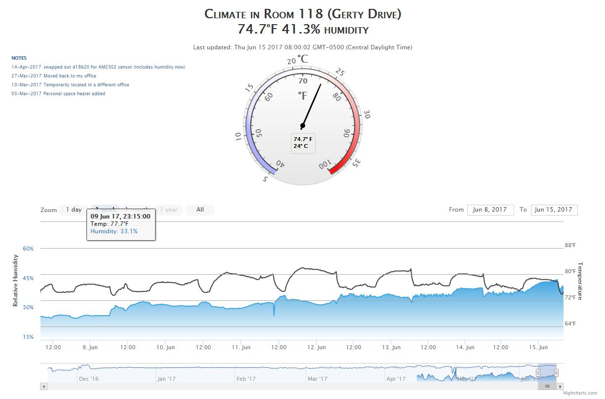

# RpiClimateTrends
Utilizing a raspberry pi to collect temperature and humidity readings, which are stored in a database and displayed via Highcharts JS framework.

## Keywords
sqlite3, raspberry_pi, json, javascript, bash, sql, highcharts

## Hardware
- Raspberry Pi (any model will work)
- 5v 1A micro-usb power adapter
- AM2302 temperature+humidity sensor (I highly recommend one that has the pull-up resistor included, and the solderless patch wires are a nice touch: https://www.amazon.com/dp/B01LXJALVW/ref=asc_df_B01LXJALVW5031340/?tag=hyprod-20&creative=395033&creativeASIN=B01LXJALVW&linkCode=df0&hvadid=193992629021&hvpos=1o3&hvnetw=g&hvrand=12169484776550499336&hvpone=&hvptwo=&hvqmt=&hvdev=c&hvdvcmdl=&hvlocint=&hvlocphy=9022196&hvtargid=pla-314802521928)

## optional hardware (to set up your raspberry pi)
- keyboard/mouse/display (+ usb hub if you are short on usb ports)
- USB wireless adapter (https://www.canakit.com/raspberry-pi-wifi.html) (only needed if wireless not already included in your RPi or wired is not a possibility)
- if using a pi zero, I recommend a pin header (either hammer-in or solder)

## Other resources
- an online host for your webpage (I am pushing data out from a private firewall, so cannot host on the pi itself)
- highcharts js framework (https://www.highcharts.com)
- raspberry pi pinout chart (https://pinout.xyz)
- source: www.cl.cam.ac.uk/freshers/raspberrypi/tutorials/temperature/
- source: http://jsfiddle.net/gh/get/jquery/3.1.1/highslide-software/highcharts.com/tree/master/samples/stock/demo/compare/
- source: http://jsfiddle.net/g8gzh96n/
- source: http://jsfiddle.net/highcharts/EjRLw/

## Example
http://onyx.csit.parkland.edu:35008

